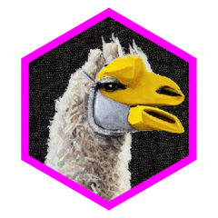

<!-- README.md is generated from README.Rmd. Please edit that file -->

# quackingllama 

<!-- badges: start -->

[](https://lifecycle.r-lib.org/articles/stages.html#experimental)
<!-- badges: end -->

The goal of `quackingllama` is to facilitate efficient interactions with
LLMs; its current target use-case is text classification
(e.g. categorise or tag contents, or extract information from text). Key
features include:

- facilitate consistently formatted responses (through [Ollama’s
  structured ouputs](https://ollama.com/blog/structured-outputs))
- facilitate local caching (by storing results in a local `DuckDB`
  database)
- facilitate initiating text classification tasks (through examples and
  convenience functions)
- facilitate keeping a record with details about how each response has
  been received

## Installation

You can install the development version of `quackingllama` from
[GitHub](https://github.com/) with:

``` r
# install.packages("pak")
pak::pak("giocomai/quackingllama")
```

## Default options and outputs

In order to facilitate consistent results, by default `quackingllama`
sets the temperature of the model to 0: this means that it will always
return the same response when given the same prompt. When caching is
enabled, responses can then consistently be retrieved from the local
cache without querying again the LLMs.

All functions consistently return results in a data frame (a tibble).

Key functionalities will be demonstrated through a series of examples.

As the package is developed further, some of the less intuitive tasks
(e.g. defining a schema) will be facilitated through dedicated
convenience functions.

## Basic examples

### Text generation

``` r
library("quackingllama")
```

Let’s generate a short piece of text. Results are returned in a data
frame, with the `response` in the first column and all relevant metadata
about the query stored along with it.

``` r
pol_df <- ql_prompt(prompt = "Describe an imaginary political leader in less than 100 words.") |>
  ql_generate()

str(pol_df)
#> tibble [1 × 21] (S3: tbl_df/tbl/data.frame)
#>  $ response            : chr "**Elias Voss** – A charismatic but enigmatic leader born in the shadow of a collapsing empire. His voice carrie"| __truncated__
#>  $ prompt              : chr "Describe an imaginary political leader in less than 100 words."
#>  $ thinking            : chr NA
#>  $ created_at          : chr "2026-08-21T16:33:43.644825292Z"
#>  $ done                : logi TRUE
#>  $ done_reason         : chr "stop"
#>  $ total_duration      : num 1.2e+10
#>  $ load_duration       : num 6.4e+09
#>  $ prompt_eval_count   : num 27
#>  $ prompt_eval_duration: num 4.6e+08
#>  $ eval_count          : num 115
#>  $ eval_duration       : num 5.09e+09
#>  $ timeout             : num 300
#>  $ keep_alive          : chr "5m"
#>  $ think               : logi FALSE
#>  $ model               : chr "ministral-3:3b"
#>  $ system              : chr "You are a helpful assistant."
#>  $ format              : chr ""
#>  $ seed                : num 0
#>  $ temperature         : num 0
#>  $ hash                : chr "0fcdfdf421d62c451ae915967f75904b"
```

``` r
cat(">", stringr::str_split(string = pol_df$response,
                            pattern = "\n",
                            simplify = TRUE))
```

> **Elias Voss** – A charismatic but enigmatic leader born in the shadow
> of a collapsing empire. His voice carries both wisdom and menace,
> blending ancient wisdom with modern ruthlessness. A former scholar, he
> now rules through a mix of cunning diplomacy and brutal pragmatism,
> dismantling old systems while building new ones under his iron grip.
> His people whisper of a godlike vision, though his methods are often
> bloodstained. Voss demands loyalty without mercy, offering only the
> faintest glimmer of hope—if you dare to follow.

If we are interested in variations of this text, we can easily create
them:

``` r
# TODO accept multiple prompts by default

pol3_df <- purrr::map(
  .x = c("progressive", "conservative", "centrist"),
  .f = \(x) {
    ql_prompt(prompt = glue::glue("Describe an imaginary {x} politician in less than 100 words.")) |>
      ql_generate()
  }
) |>
  purrr::list_rbind()

pol3_df$response
#> [1] "**Dr. Eleanor Voss** is a progressive visionary blending idealism with pragmatism. A former community organizer, she champions climate justice, affordable healthcare, and universal education while advocating for economic equity. Her policies prioritize worker cooperatives, green infrastructure, and participatory democracy, using data-driven advocacy to dismantle systemic inequalities. A fierce ally of marginalized voices, she balances bold reforms with compassionate governance, ensuring policies uplift—not just the privileged few. Her leadership is rooted in empathy, fairness, and the belief that progress must be inclusive."                                                                                                                                                         
#> [2] "**Senator Marcus Holloway** is a staunch conservative firebrand, a man of unyielding principles and unshakable faith. With a voice like gravel and a demeanor of stern resolve, he champions traditional values, fiscal discipline, and limited government. A self-made man who rose from modest beginnings, Holloway speaks of \"American exceptionalism\" with a fervor that borders on zealotry. He opposes progressive policies with a relentless, almost biblical zeal, often framing his opposition as a defense of \"God, Guns, and Godfather.\" His rallies are packed with fervent supporters, and his debates are marked by heated rhetoric and a refusal to compromise. Though polarizing, Holloway’s unwavering commitment to his beliefs makes him a formidable voice in the conservative movement."
#> [3] "**Name:** Dr. Eleanor Whitmore\n**Party:** *Unity Forward* (a pragmatic, non-partisan coalition)\n**Ideal:** *\"Government should serve the people—not the extremes.\"*\n\nWhitmore is a former economist turned diplomat, known for her **balanced rhetoric**—rejecting both populist chaos and bureaucratic inertia. She champions **middle-ground policies**: tax reform to ease burdens, infrastructure without debt, and climate action with market incentives. A master of compromise, she avoids polarizing stances, instead framing issues as *\"how do we make this work for everyone?\"* Her charm and calm demeanor make her a bridge between factions, though critics call her *\"too soft\"* or *\"too smart.\"*"
```

These are, as it is the customary default behaviour of LLMs, free form
texts. Depending on the task at hand, we may want to have text in a more
structured format. To do so, we must provide the LLM with a
[schema](https://json-schema.org/) of how we want it to to return data.

Schema can be very simple, e.g., if we want our response to feature only
a “name” and “description” field, and both should be character strings,
we’d use the following schema:

``` r
# TODO convenience function to facilitate creation of common schemas

schema <- list(
  type = "object",
  properties = list(
    `name` = list(type = "string"),
    `description` = list(type = "string")
  ),
  required = c("name", "description")
)
```

``` r
pol_schema_df <- ql_prompt(
  prompt = "Describe an imaginary political leader.",
  format = schema
) |>
  ql_generate()

pol_schema_df$response |>
  yyjsonr::read_json_str()
#> $name
#> [1] "Dr. Elias Voss"
#> 
#> $description
#> [1] "A visionary yet pragmatic political leader born in 1968 in the small industrial town of Bad Homburg, Germany. Raised in a working-class family, Elias grew up witnessing the economic struggles and social inequalities of his region, which deeply influenced his political philosophy."
```

or slightly more complex, for example making clear that we expect a
field to be numeric, and another one to pick between one of a set of
options:

``` r
schema <- list(
  type = "object",
  properties = list(
    `name` = list(type = "string"),
    `age` = list(type = "number"),
    `gender` = list(
      type = "string",
      enum = c("female", "male", "non-binary")
    ),
    `motto` = list(type = "string"),
    `description` = list(type = "string")
  ),
  required = c(
    "name",
    "age",
    "gender",
    "motto",
    "description"
  )
)
```

And the returned is formatted as expected:

``` r
pol_schema_df <- ql_prompt(
  prompt = "Describe an imaginary political leader.",
  format = schema
) |>
  ql_generate()

pol_schema_df$response |>
  yyjsonr::read_json_str()
#> $name
#> [1] "Dr. Elias Voss"
#> 
#> $age
#> [1] 68
#> 
#> $gender
#> [1] "male"
#> 
#> $motto
#> [1] "Unity Through Vision"
#> 
#> $description
#> [1] "Dr. Elias Voss is a charismatic and visionary political leader born in the heart of a once-thriving industrial city in Europe. Raised in modest circumstances, he developed a deep empathy for the struggles of ordinary people while his intellect and passion for social justice fueled his ambition. His political career began in the early 2000s, marked by a relentless commitment to reforming the political system to address inequality and environmental degradation."
```

Having the response in a structured format allows for easily storing
results in a data frame and processing them further.

``` r
pol3_schema_df <- purrr::map(
  .x = c("progressive", "conservative", "centrist"),
  .f = \(x) {
    ql_prompt(
      prompt = glue::glue("Describe an imaginary {x} politician."),
      format = schema
    ) |>
      ql_generate()
  }
) |>
  purrr::list_rbind()

pol3_schema_responses_df <- purrr::map(
  .x = pol3_schema_df$response,
  .f = \(x) {
    yyjsonr::read_json_str(x) |>
      tibble::as_tibble()
  }
) |>
  purrr::list_rbind()

pol3_schema_responses_df
#> # A tibble: 3 × 5
#>   name                    age gender motto                           description
#>   <chr>                 <int> <chr>  <chr>                           <chr>      
#> 1 Étienne Laurent-Duval    52 male   Progressive governance through… Étienne La…
#> 2 Alexander Voss           58 male   Order, Tradition, and Responsi… Alexander …
#> 3 Étienne Laurent-Duval    52 male   Balance, pragmatism, and a tou… Étienne La…
```

`quackingllama` has convenience functions to create and process schemas
to be used for generating structured outputs, when multiple answers
should all give one of a set of replies. See this example:

``` r
schema_l <- ql_create_schema_enum(
  questions = c(
    "Does this story include humans",
    "Does this story include animals",
    "Is this story about a woman",
    "Does this story have a happy ending"
  ),
  answers = c("Yes", "No", "Maybe", "Cannot answer")
)


schema_l
#> $type
#> [1] "object"
#> 
#> $properties
#> $properties$`Does this story include humans`
#> $properties$`Does this story include humans`$type
#> [1] "string"
#> 
#> $properties$`Does this story include humans`$enum
#> [1] "Yes"           "No"            "Maybe"         "Cannot answer"
#> 
#> 
#> $properties$`Does this story include animals`
#> $properties$`Does this story include animals`$type
#> [1] "string"
#> 
#> $properties$`Does this story include animals`$enum
#> [1] "Yes"           "No"            "Maybe"         "Cannot answer"
#> 
#> 
#> $properties$`Is this story about a woman`
#> $properties$`Is this story about a woman`$type
#> [1] "string"
#> 
#> $properties$`Is this story about a woman`$enum
#> [1] "Yes"           "No"            "Maybe"         "Cannot answer"
#> 
#> 
#> $properties$`Does this story have a happy ending`
#> $properties$`Does this story have a happy ending`$type
#> [1] "string"
#> 
#> $properties$`Does this story have a happy ending`$enum
#> [1] "Yes"           "No"            "Maybe"         "Cannot answer"
#> 
#> 
#> 
#> $required
#> [1] "Does this story include humans"      "Does this story include animals"    
#> [3] "Is this story about a woman"         "Does this story have a happy ending"


responses_df <- ql_prompt(
  prompt = "this it the story of a duck that escapes",
  format = schema_l,
) |>
  ql_generate() |>
  dplyr::pull("response") |>
  yyjsonr::read_json_str() |>
  tibble::as_tibble()

t(responses_df)
#>                                     [,1] 
#> Does this story include humans      "No" 
#> Does this story include animals     "Yes"
#> Is this story about a woman         "No" 
#> Does this story have a happy ending "No"

responses_df <- ql_prompt(
  prompt = "this it the story of a duck that escapes from a lady",
  format = schema_l
) |>
  ql_generate() |>
  dplyr::pull("response") |>
  yyjsonr::read_json_str() |>
  tibble::as_tibble()

t(responses_df)
#>                                     [,1] 
#> Does this story include humans      "Yes"
#> Does this story include animals     "Yes"
#> Is this story about a woman         "Yes"
#> Does this story have a happy ending "No"


responses_df <- ql_prompt(
  prompt = "this is not a story and nothing happens",
  format = schema_l
) |>
  ql_generate() |>
  dplyr::pull("response") |>
  yyjsonr::read_json_str() |>
  tibble::as_tibble()

t(responses_df)
#>                                     [,1]
#> Does this story include humans      "No"
#> Does this story include animals     "No"
#> Is this story about a woman         "No"
#> Does this story have a happy ending "No"
```

This approach has obvious advantages for many data processing tasks,
and, as will be seen, can effectively be used to enhance the consistency
of text classification tasks. But first, let’s discuss caching and some
of the options that determine output.

### Caching and options

So far, local caching has not been enabled: this means that even when
the exacts same response is expected, this will still be requested to
the LLM, which can be exceedingly time-consuming especially for
repetitive tasks, or for data processing pipelines that may recurrently
encounter the same data.

Caching is the obvious answer to this process, but when do we expect
exactly the same response from the LLM, considering that LLMs do not
necessarily return the same response even when given the same prompt?

Two parameters are particularly relevant for understanding this,
`temperature` and `seed`.

What is “temperature”? [Ollama’s
documentation](https://github.com/ollama/ollama/blob/main/docs/modelfile.md#valid-parameters-and-values)
concisely clarifies the effect of this parameter by suggesting that
“Increasing the temperature will make the model answer more creatively.”
LLMs often have the default temperature set to 0.7 or 0.8. In brief,
when temperature is set to its maximum value of 1, the LLMs will provide
more varied responses. When temperature is set to 0, the LLMs are at
their more consistent: they always provide the same response to the same
prompt.

What does it mean in practices? For example, that if I set the
temperature to 0 and ask the same LLM to generate a haiku, I will always
get the very same haiku, no matter how many times I run this command.

``` r
ql_prompt(prompt = "A reasonably funny haiku", temperature = 0) |>
  ql_generate() |>
  dplyr::pull(response)
#> [1] "Moonlight glows—\na cat steals my sandwich,\nthen naps on my lap."
ql_prompt(prompt = "A reasonably funny haiku", temperature = 0) |>
  ql_generate() |>
  dplyr::pull(response)
#> [1] "Moonlight glows—\na cat steals my sandwich,\nthen naps on my lap."
ql_prompt(prompt = "A reasonably funny haiku", temperature = 0) |>
  ql_generate() |>
  dplyr::pull(response)
#> [1] "Moonlight glows—\na cat steals my sandwich,\nthen naps on my lap."
```

If I set the temperature to 1, I get every time a different haiku (ok,
not very different, really, but still different).

``` r
ql_prompt(prompt = "A reasonably funny haiku", temperature = 1) |>
  ql_generate() |>
  dplyr::pull(response)
#> [1] "Dogs bark at ghost—they're not alone,\nReflection in their wagging tails twists,\nTrickster moon has fun.\n\n*(Keeps the mystery and playfulness rolling!)*"
ql_prompt(prompt = "A reasonably funny haiku", temperature = 1) |>
  ql_generate() |>
  dplyr::pull(response)
#> [1] "Watching snowflakes dance—\none slips right past my tongue,\nnature’s *starter* bite."
ql_prompt(prompt = "A reasonably funny haiku", temperature = 1) |>
  ql_generate() |>
  dplyr::pull(response)
#> [1] "Soft rain dances—\npuddle glows like a neon star,\nlaughs in the mirror."
```

But then, replicability of results is possible even when the temperature
is set to a value higher than 0. We just need to set the same seed, and
we’ll consistently get the same result.

``` r
ql_prompt(prompt = "A reasonably funny haiku", temperature = 1, seed = 2025) |>
  ql_generate() |>
  dplyr::pull(response)
#> [1] "Soft rain on rooftops sings—\n\"Pizza delivery, *ding*—\nworld’s a happy clown! 🍕🎭"
ql_prompt(prompt = "A reasonably funny haiku", temperature = 1, seed = 2025) |>
  ql_generate() |>
  dplyr::pull(response)
#> [1] "Soft rain on rooftops sings—\n\"Pizza delivery, *ding*—\nworld’s a happy clown! 🍕🎭"
ql_prompt(prompt = "A reasonably funny haiku", temperature = 1, seed = 2025) |>
  ql_generate() |>
  dplyr::pull(response)
#> [1] "Soft rain on rooftops sings—\n\"Pizza delivery, *ding*—\nworld’s a happy clown! 🍕🎭"
```

Two additional components determine if the response is exactly the same
in different instances: `system` and `format`. The `system` parameter is
passed along with the prompt to the LLM, and by default is set to the
generic “You are a helpful assistant.”. This is a reasonable generic
option, but there may be good reasons to be more specific depending on
the task at hand.

For example, if we set as the system message “You are a 19th century
romantic poet.”, the style of the response will change (somewhat)
accordingly.

``` r
ql_prompt(
  prompt = "A reasonably funny haiku",
  temperature = 0,
  system = "You are a 19th century romantic writer."
) |>
  ql_generate() |>
  dplyr::pull(response)
#> [1] "*\"Whispers drift on breezes soft—*\n*Moonlit garden hums a tune,*\n*Love’s ghost dances—what a sight!\"*\n\n*(A touch of whimsy, dear reader—let the stars weave their magic!)* 🌙✨"
```

As discussed above, `format` is relevant only for instances when a
structured output is requested to the LLM by providing a schema. For
example, if we provided a different schema, the output would also have
been different.

``` r
schema <- list(
  type = "object",
  properties = list(
    `haiku` = list(type = "string"),
    `why_funny` = list(type = "string")
  ),
  required = c(
    "haiku",
    "why_funny"
  )
)

haiku_str_df <- ql_prompt(
  prompt = "Write a funny haiku, and explain why it is supposed to be funny.",
  format = schema
) |> ql_generate()

haiku_str_df |>
  dplyr::pull(response) |>
  yyjsonr::read_json_str()
#> $haiku
#> [1] "Pizza crust burns—oh no!\nCrumbles fly like tiny tornadoes,\nDinner’s a crime scene."
#> 
#> $why_funny
#> [1] "This haiku plays on the absurdity of a common kitchen mishap—overcooked pizza crust exploding like a bomb! The 'tiny tornadoes' of crumbs add a whimsical, almost comedic chaos, while 'dinner’s a crime scene' leans into the exaggerated, over-the-top humor. It’s funny because it turns a mundane (but relatable) moment into a ridiculous, almost slapstick scenario."
```

In brief, when should we expect to receive exactly the same response
from the LLM, hence, making it possible to retrieve it from cache if
already parsed? The following conditions must apply:

- same model
- same `system` parameter
- same `format`, i.e., same schema (if given).
- same prompt
- and
  - either the same seed and any value for `temperature` OR
  - any seed and `temperature` set to zero

If the above conditions are met, and caching is enabled, the response
will be retrieved from the local cache, rather than from the LLM.

It’s easy to enable caching for the current session with
`ql_enable_db()`. By default, the database is stored in the current
working directory, but this can be changed with `ql_set_db_options()`.

``` r
ql_enable_db()
ql_set_db_options(db_folder = fs::path_home_r("R"))
```

Now even prompts that would take the LLM many seconds to process can be
returned efficiently from cache:

### Text classification

First, let’s create some texts that we will then try to classify:

``` r
schema <- list(
  type = "object",
  properties = list(
    `party name` = list(type = "string"),
    `political leaning` = list(
      type = "string",
      enum = c("progressive", "conservative")
    ),
    `political statement` = list(type = "string")
  ),
  required = c(
    "party name",
    "political leaning",
    "political statement"
  )
)

parties_df <- purrr::map2(
  .x = rep(c("progressive", "conservative"), 5),
  .y = 1:10,
  .f = \(x, y) {
    ql_prompt(
      prompt = glue::glue("Describe an imaginary {x} political party, inventing their party name and a characteristic political statement."),
      format = schema,
      temperature = 1,
      seed = y,
      model = "llama3.2:1b"
    ) |>
      ql_generate()
  }
) |>
  purrr::list_rbind()

parties_responses_df <- purrr::map(
  .x = parties_df$response,
  .f = \(x) {
    yyjsonr::read_json_str(x) |>
      tibble::as_tibble()
  }
) |>
  purrr::list_rbind()

parties_responses_df
#> # A tibble: 10 × 3
#>    `party name`                        `political leaning` `political statement`
#>    <chr>                               <chr>               <chr>                
#>  1 Eunoia Greens                       progressive         Empowering the Peopl…
#>  2 New Heritage Alliance (NHA)         conservative        Unity in Tradition, …
#>  3 The Luminari Coalition              progressive         Embracing the Light:…
#>  4 The Heritage Conservators           conservative        Empowering the Next …
#>  5 Eunoia Alliance for Progressive Eq… progressive         Embracing the princi…
#>  6 The Liberty Keepers                 conservative        The Liberty Keepers …
#>  7 EchoPlexia                          progressive         The EchoPlexia party…
#>  8 Libertas Permanens                  conservative        Libertas Permanens s…
#>  9 The Unity Assembly                  progressive         In the spirit of uni…
#> 10 Veritas Republicanorum              conservative        Our founding fathers…
```

Then we ask a different model to categorise results (in this example,
text generation with `llama3.2:1b`, text categorisation with
`gemma4:e4b-it-qat`). Trimming explanations in the following table for
clarity.

``` r
category_schema <- list(
  type = "object",
  properties = list(
    `political leaning` = list(
      type = "string",
      enum = c("progressive", "conservative")
    ),
    `explanation` = list(type = "string")
  ),
  required = c(
    "political leaning",
    "explanation"
  )
)

categories_df <- purrr::map(
  .x = parties_responses_df[["political statement"]],
  .f = \(current_statement) {
    ql_prompt(
      prompt = current_statement,
      system = "You identify the political leaning of political parties based on their statements.",
      format = category_schema,
      temperature = 0,
      model = "gemma4:e4b-it-qat"
    ) |>
      ql_generate()
  }
) |>
  purrr::list_rbind()

categories_responses_df <- purrr::map(
  .x = categories_df$response,
  .f = \(x) {
    yyjsonr::read_json_str(x) |>
      tibble::as_tibble()
  }
) |>
  purrr::list_rbind()


responses_combo_df <- dplyr::bind_cols(
  parties_responses_df |>
    dplyr::rename(`given political leaning` = `political leaning`) |>
    dplyr::select(`political statement`, `given political leaning`),
  categories_responses_df |>
    dplyr::rename(`identified political leaning` = `political leaning`)
)

responses_combo_df |>
  dplyr::mutate(explanation = stringr::str_trunc(explanation, width = 200) |> 
                  stringr::str_remove_all(pattern =  "\n")) |>
  knitr::kable()
```

| political statement | given political leaning | identified political leaning | explanation |
|:---|:---|:---|:---|
| Empowering the People, Building a Sustainable Future | progressive | progressive | The phrase ‘Empowering the People, Building a Sustainable Future’ is a classic example of progressive political rhetoric. It emphasizes the importance of individual agency and collective action (’E… |
| Unity in Tradition, Freedom in Progress | conservative | conservative | The phrase ‘Unity in Tradition, Freedom in Progress’ is a classic example of a conservative political slogan. It suggests that a strong foundation in established values, customs, and institutions (… |
| Embracing the Light: Empowering a Brighter Future for All | progressive | progressive | The phrase ‘Embracing the Light: Empowering a Brighter Future for All’ is inherently optimistic, aspirational, and inclusive. It suggests a movement toward positive change, enlightenment, and unive… |
| Empowering the Next Generation, One Heritage at a Time. | conservative | conservative | The phrase ‘Empowering the Next Generation, One Heritage at a Time’ strongly suggests a focus on preserving and celebrating cultural traditions, history, and values. This aligns with conservative i… |
| Embracing the principles of equality, justice, and compassion, the Eunoia Alliance for Progressive Equality and Justice seeks to create a society where every individual has the opportunity to thrive, regardless of their background, identity, or socio-economic status. We believe in the power of collective action, community-driven solutions, and the empowerment of marginalized voices. We stand in solidarity with the rights and dignity of all people, and we will fight tirelessly for a world where love, kindness, and respect prevail. | progressive | progressive | The Eunoia Alliance for Progressive Equality and Justice explicitly advocates for principles of equality, justice, and compassion. Its mission is to create a society where everyone has the opportun… |
| The Liberty Keepers believe that the rights and freedoms of the American people should be protected and preserved through the principles of limited government, free market economics, and strong national defense. We are committed to promoting economic growth, reducing government overreach, and preserving our nation’s heritage and traditions. We believe that the values of hard work, family, and community are essential to the success of our country and that they should be the foundation upon which our nation is built. | conservative | conservative | The Liberty Keepers’ platform strongly aligns with conservative political ideologies. Key indicators include the emphasis on ‘limited government,’ ‘free market economics,’ and ’reducing government … |
| The EchoPlexia party is committed to creating a more inclusive, just, and equitable society for all citizens. Our guiding principle is that every individual has the right to thrive, regardless of their background, identity, or socio-economic status. We believe in the power of collective action and the importance of listening to and amplifying the voices of marginalized and underrepresented communities. Our party’s slogan is ‘Empowering Every Voice, Amplifying Our Collective Future.’ | progressive | progressive | The EchoPlexia party’s platform is rooted in principles of social justice, inclusivity, and equity. Key indicators include the commitment to creating a ’more inclusive, just, and equitable society,… |
| Libertas Permanens seeks to defend and preserve the timeless principles of traditional values, individual freedom, and limited government. We believe in the sanctity of marriage, the importance of family, and the need for a strong, national defense. Our platform is built on the conviction that the welfare of our nation is best ensured by a steadfast commitment to these values, and that the rule of law, rather than the whims of special interests, should guide our governance. | conservative | conservative | The provided text outlines a platform that strongly aligns with traditional conservative principles. Key indicators include the emphasis on ‘traditional values,’ ‘individual freedom,’ and ’limited … |
| In the spirit of unity and a shared future, we call for a fundamental shift in the way our country approaches its challenges. We believe that the greatest threat to our nation is not the other party, but rather our own internal divisions and biases. Therefore, we propose the creation of a non-partisan cabinet system, where leaders from diverse backgrounds and regions come together to make decisions that benefit the people, not just special interests. We also pledge to invest in education, healthcare, and infrastructure, because we believe that these fundamental human rights are essential to our collective well-being. By working together and putting the people first, we can build a more just, equitable, and prosperous society for all. | progressive | progressive | The text advocates for a fundamental shift in governance, emphasizing unity over partisan conflict. Key proposals include a non-partisan cabinet system, which aims to transcend traditional politica… |
| Our founding fathers knew best - the Constitution is a rock-solid foundation upon which our great nation was built. We must stand strong against the forces of socialism, liberalism, and the erosion of traditional values. Our party’s guiding principle is: ‘One Nation, Under God, with Liberty and Justice for All - and for the sake of our children’s future.’ | conservative | conservative | The provided text strongly aligns with conservative political ideologies. Key indicators include: \* **Emphasis on Founding Principles:** The reverence for the Constitution as a ’rock-solid foun… |

In this stereotyped case, the LLM categorises most statements as
expected and provide a broadly meaningful explanation for the choice (if
you try with shorter sentences, e.g., just a political motto, the
correct response rate decreases substantially). Fundamentally:

- responses are returned in a predictable and user-defined format,
  consistently responding with user-defined categories
- responses are cached locally:
  - re-running a categorisation task is efficient
  - the categorisation of a large set of texts can be interrupted at
    will, and already processed contents will not be categorised again.

Querying with different models can have a substantial impact on the
quality of results.

## Pass images to the model

You can pass images and have multimodal models such as
e.g. “llama3.2-vision” or (the considerably smaller) “llava-phi3” or
“qwen3.5:2b” consider them in their response. Just pass the path of the
relevant image to `ql_prompt()`. For example, if we ask to describe the
logo of this package, we get the following reponse:

``` r
library("quackingllama")

img_path <- fs::path(
  system.file(package = "quackingllama"),
  "help",
  "figures",
  "logo.png"
)

resp_df <- ql_prompt(
  prompt = "what is this?",
  images = img_path,
  model = "qwen3.5:2b"
) |>
  ql_generate()


cat(">", stringr::str_split(string = resp_df$response,
                            pattern = "\n",
                            simplify = TRUE))
```

> This is a stylized, cartoonish illustration of a **llama** wearing a
> yellow beak mask and a white respirator or face shield. The image has
> been framed within a bright pink hexagon with a black background. It
> appears to be: - A digital art piece or graphic design - Possibly
> related to animal-themed content, humor, or even a meme (the llama’s
> exaggerated expression adds comedic effect) - Could represent
> something like “animal protection,” “respiratory health awareness,” or
> just playful creativity — though the mask might also imply concern for
> animals’ well-being The overall vibe is whimsical and modern, likely
> intended for social media, branding, or entertainment purposes. Let me
> know if you’d like help identifying it further or understanding its
> context!

``` r
resp_df <- ql_prompt(
  prompt = "what is this?",
  images = img_path,
  model = "llava-phi3"
) |>
  ql_generate()


cat(">", resp_df$response)
```

> The image features a close-up of a llama’s face, which is the central
> focus of the image. The llama’s face is white, and it has a yellow and
> gray mask covering its eyes and mouth. The mask is attached to the
> llama’s face with a gray strap. The background of the image is black,
> providing a stark contrast to the llama’s face and the mask. The image
> is framed by a pink border, adding a pop of color to the overall
> composition. The llama appears to be looking straight ahead, its gaze
> directed towards the viewer. The mask obscures its eyes and mouth,
> adding an element of mystery to the image. The image does not contain
> any text. The relative position of the objects is such that the
> llama’s face is centrally located, with the mask covering its eyes and
> mouth, and the pink border framing the image. The black background
> surrounds the entire image, further emphasizing the llama and the
> mask.

## Thinking models

In May 2025, Ollama started supporting “thinking” models ([more details
in the post announcing the feature](https://ollama.com/blog/thinking)).
Pay attention to the fact that not all reasoning models available via
Ollama actually support thinking mode; as of July 2025, only three
models were effectively supported (`deepseek-r1`, `qwen3`, and
`magistral`). An [up-to-date list should be available on Ollama’s
website](https://ollama.com/search?c=thinking).

When thinking mode is enabled, the LLM goes through an iterative
“thinking” process before providing its answer. The “thinking” process
is expressed in plain English and can be seen along with the response.
When `thinking` is enabled, response time grows considerably, so you may
want to extend the timeout options.

See the following example:

``` r
strawberry_t_df <- ql_prompt(
  prompt = "How many r are there in strawberry? Provide a concise answer.",
  model = "deepseek-r1:1.5b",
  think = TRUE) |>
  ql_generate(keep_alive = "10m", timeout = 1000)
```

Here’s the thinking:

``` r

cat(">", strawberry_t_df$thinking |> stringr::str_replace_all(pattern = stringr::fixed("\n"), replacement = "\n > ")) 
```

> Okay, so I need to figure out how many ‘r’s are in the word
> “strawberry.” Hmm, let me start by writing out the word to make it
> easier. S, t, r, a, w, b, e, r, u, r, y. Wait, that’s 12 letters. Now,
> I need to count how many times the letter ’r’ appears in there.
>
> Let me go through each letter one by one. The first letter is S, which
> isn’t an ‘r.’ The second is T, also not an ‘r.’ The third is R, which
> is an ‘r.’ So that’s one. Then A, W, B, E—none of those are ‘r’s. Next
> is U, which is U, not an ’r.’ Then R again, so that’s two. Finally, Y,
> which isn’t an ‘r.’
>
> Wait, did I miss any? Let me check again. S, T, R, A, W, B, E, R, U,
> R, Y. Yeah, only two ’r’s. So the answer should be two ’r’s in
> “strawberry.”

And here is the response:

``` r
cat(">", strawberry_t_df$response)
```

> There are two ’r’s in the word “strawberry.”

## Translate text

Google made public a model specifically tuned for translating text,
`translategemma`, providing [clear
instructions](https://ollama.com/library/translategemma) on how the
prompts should be structured. The function `ql_translate()` streamlines
the process: it is enough to provide an input text, and the target
language, and all the rest is managed internally. Input language can be
provided; if not provided, it is auto-detected.

``` r
dracula_en_text <- ql_prompt(prompt = "Describe Dracula in one sentence") |> 
  ql_generate() |> 
  dplyr::pull(response)

cat(">", dracula_en_text)
```

> Dracula, the iconic vampire lord, is a brooding, aristocratic figure
> from Bram Stoker’s *Dracula* (1897), embodying eerie charm, ancient
> power, and a relentless pursuit of immortality through conquest and
> seduction.

``` r


dracula_it_text <- ql_translate(text = dracula_en_text,
             target_language = "italian") |> 
  dplyr::pull(response)

cat(">", dracula_it_text)
```

> Dracula, il celebre signore vampiro, è una figura malinconica e
> aristocratica tratta da *Dracula* di Bram Stoker (1897), che incarna
> un fascino inquietante, un potere antico e una ricerca implacabile
> dell’immortalità attraverso la conquista e la seduzione.

## About context windows and time-outs

`ollama` is great in enabling easy local deployment of local LLMs, but
comes with some embedded defaults that may come with unintended
consequences.

### About the context window

If you look at the model page of one of the models available from
Ollama’s website, you may well notice that some of these come with very
large context windows. For example,
[`gemma3`](https://ollama.com/library/gemma3) boasts a “128K context
window”, big enough to include book-length inputs. You may well expect
that, by default, this context window is fully available to you. You
would, however, be mistaken: no matter the model’s capabilities, Ollama
truncates the input at 2048 tokens: as a user, you would notice it only
if you looked at the `ollama serve` logs, or because you notice
unsatisfying results, as truncation happens in a way that is mostly
invisible to the client. This is a known issue with Ollama, and until
this is approached more sensibly by Ollama, the user should take core of
this limitation themselves (`quackingllama` will likely include a
dedicated warning in future versions). The easiest workaround is to
re-create a new model with a larger context window: it’s a matter of a
few seconds, following the [instructions reported in the relevant issue
on
Ollama](https://github.com/ollama/ollama/issues/8099#issuecomment-2543316682).

Basically, from the command line you do something like this:

    $ ollama run gemma3
    >>> /set parameter num_ctx 65536
    Set parameter 'num_ctx' to '65536'
    >>> /save gemma3-64k
    Created new model 'gemma3-64k'
    >>> /bye

And in a matter of seconds you will get a `gemma3` model with a 64k
context window, which you’ll be able to use by choosing `gemma3-64k` as
model.

### About `timeout` and `keep_alive`

Congratulations, now you can enjoy bigger context windows. This is all
nice, but this makes it also more likely that you are going to stumble
into time-out issues, as processing lengthy prompts can take many
minutes.

There are two parameters that determine how long `quackingllama` will
wait for a response from `ollama` before throwing an error.

- one is `ollama`’s `keep_alive` argument, that basically tells how long
  the model should remain in memory after it is called. By default, this
  is “5m” for five minutes. If the model doesn’t get a response in time,
  it throws an error.
- one is `httr2`’s `timeout` argument, that expresses how long the
  client should be waiting for a response. This defaults to “300”, as it
  is expressed in seconds, and corresponds to 5 minutes.

The combined effect of these two arguments may not be exactly as you
expect (a 5 minute `keep_alive` may actually let the model run for 10
minutes, if your `timeout` argument is big enough), but either way, be
mindful and if you do expect lengthy response times, do set both values
to an adequately high value.

On the other hand, if you know you have short prompts and expect quick
responses, the defaults are more efficient, and will just move on sooner
if the model is stuck for whatever reason.

## About the hex logo

In the logo you may or may not recognise a quacking llama, or maybe,
just a llama wearing a duck mask. The reference is obviously to two of
the main tools used by this package: [`ollama`](https://ollama.com/) and
[`DuckDB`](https://duckdb.org/docs/api/r.html). Image generated on my
machine with `stablediffusion`.
